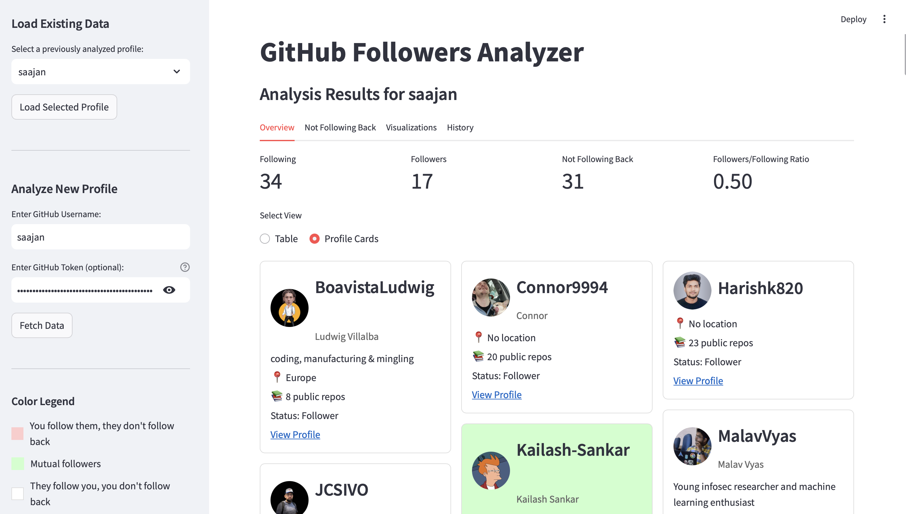
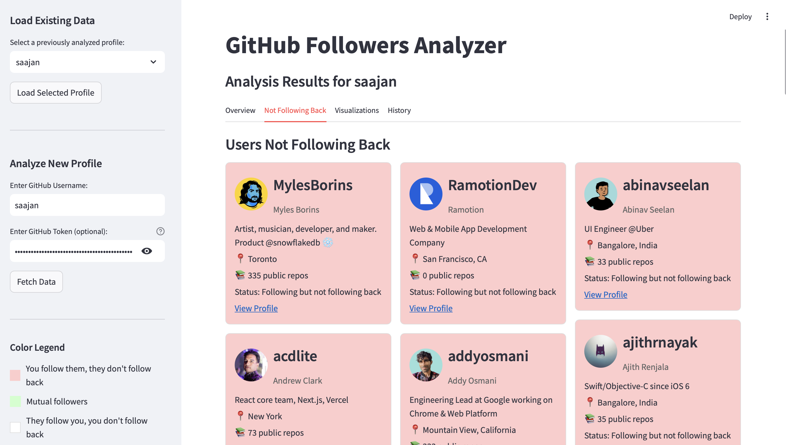
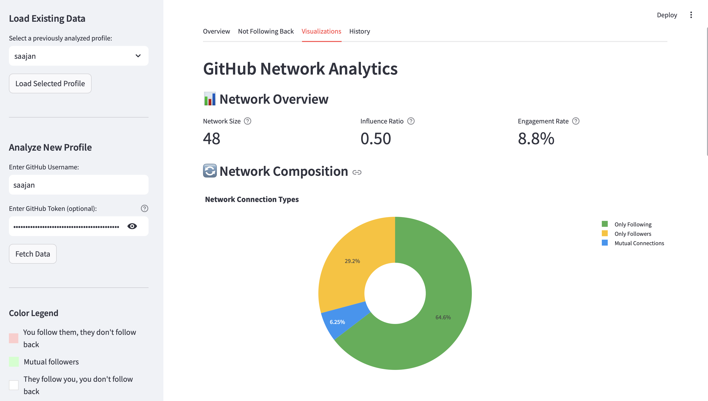

# GitHub Follow Check 📊

A Streamlit web app that analyzes your GitHub network to see who follows you and who doesn't follow you back.

  
  
  

## Features

- **Network Overview**: See stats on your followers, following, and mutual connections
- **Profile Cards**: Browse through your connections with visual profile cards
- **Not Following Back**: Easily identify users who don't follow you back
- **Data Visualizations**: 
  - Network composition pie chart
  - Geographic distribution of your connections
  - Top users analysis by public repositories
- **Follow-Back Opportunities**: Find active users who follow you that you might want to follow back
- **Historical Analysis**: Track changes in your network over time
- **CSV Export**: Download your data for offline analysis

## Technologies

- **Streamlit**: Powers the interactive web interface
- **GitHub API**: Fetches user and connection data
- **SQLite**: Stores user profiles and relationship data
- **Pandas**: Data manipulation and analysis
- **Plotly**: Interactive data visualizations
- **Matplotlib & Seaborn**: Additional charting capabilities
- **Python**: Core programming language

## Installation

```bash
# Clone the repository
git clone https://github.com/saajann/github-followers-analyzer.git

# Navigate to project directory
cd github-follow-check

# Install required packages
pip install -r requirements.txt

# Run the app
streamlit run scripts/app.py
```

## Usage

1. Enter your GitHub username in the sidebar
2. Optionally add a GitHub token for higher API rate limits
3. Click "Fetch Data" to analyze your network
4. Navigate through the tabs to explore different insights:
   - **Overview**: General stats and connections table/cards
   - **Not Following Back**: Users who don't reciprocate your follow
   - **Visualizations**: Charts and analytics about your network
   - **History**: Compare network changes over time

## Color Legend

- 🟥 Red: You follow them, they don't follow back
- 🟩 Green: Mutual follow connection
- ⬜ White: They follow you, you don't follow back

## Database

The app uses SQLite to store:
- User profile information
- Connection relationships
- Historical analysis data

All data is stored locally in the `data` directory.

## Privacy & Rate Limits

- All data is stored locally on your machine
- Using a GitHub token increases API rate limits (strongly recommended for users with large networks)
- The app respects GitHub's API guidelines

## Contributing

Contributions are welcome! Please feel free to submit a pull request.
